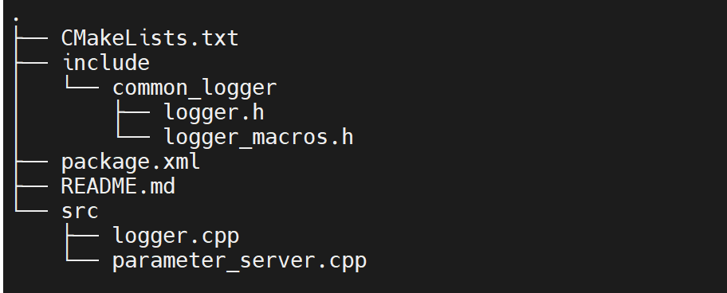
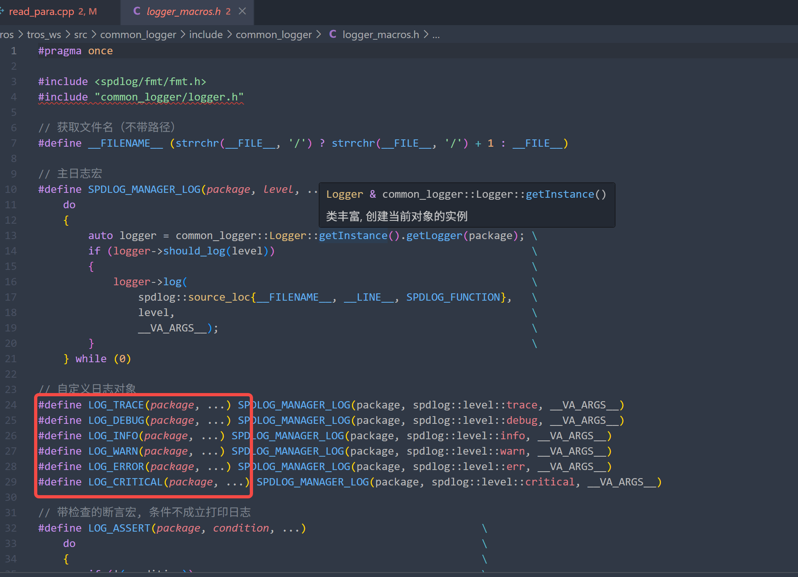
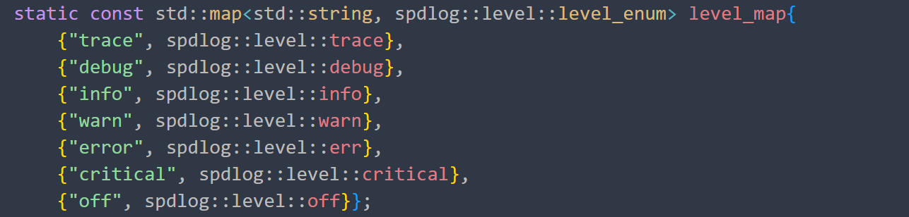
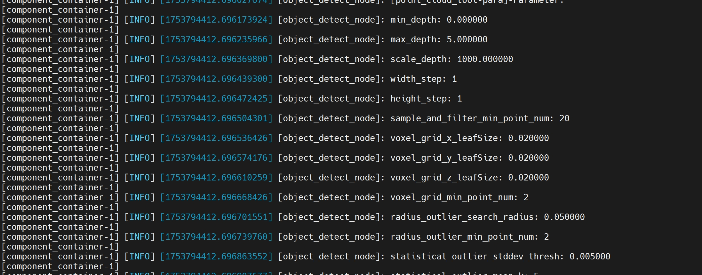
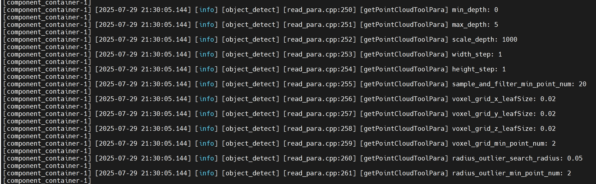

# 3common_logger

## 1.功能简介

common_logger:是一个脱离ros的基于spdlog进行封装的功能包, 基于在ros2中打印日志需要传入ros node 节点, 但是很多功能脱离ros的,为了对ros功能包进行统一的日志管理,开发此功能包,因为ros2日志的底层也是使用spdlog,所以这里对spdlog进行封装.

具备功能:

* 1.支持一个日志对象管理多个功能包的日志;
* 2.支持各个功能包日志独立管理;
* 3.日志详细,输出的日志包括:日志等级, 详细直观时间, 功能包名,文件名, 行号, 函数名;
* 4.输出日志级别可控;

## 2.目录结构



## 3.操作流程

1. 拉取代码(将代码拉取到和自己功能包同级目录下):

   ```
   git clone https://github.com/D-Robotics/common_logger.gitgit clone 
   ```
2. 编译代码

   ```
   bash ./robot_dev_config/build.sh -p X5 -s common_logger
   ```

## 4. 使用教程

目前支持的日志级别如下:



日志使用方式如下:

假设设置日的名称为:std::string package_log_name = "object_detect"

1. 打印日志

   ```
   LOG_INFO(package_log_name, "remove_ground_config_file_path={}", config_path)
   ```

2.设置日志输出级别



比如设置日志的级别为:info

```
SET_PACKAGE_LOG_LEVEL(package_log_name, spd::level::info)
```

## 5.日志示例

ros2 日志：



common_logger日志：20250730-195822


